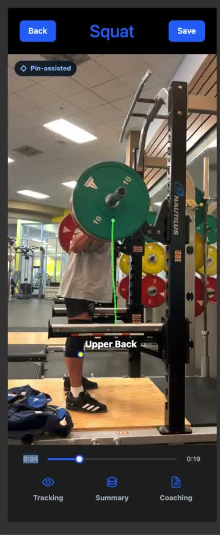
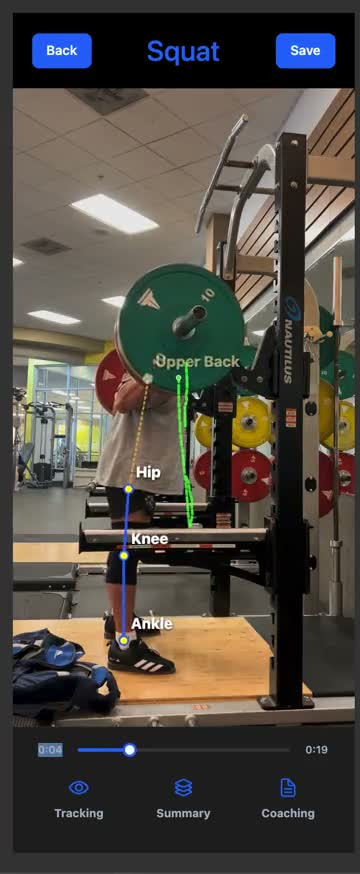

# Peso

Peso is a mobile-first lifting analysis app that turns a workout video into visual feedback, rep summaries, and technique cues.

The current version focuses on side-view squat analysis. A user uploads or records a squat video, Peso processes the movement, tracks the lifter and barbell, and returns an analyzed playback view with movement overlays and coaching feedback.

## Demo

<p align="center">
  <a href="assets/demo/peso-pin-assisted-bar-path.mp4">
    
  </a>
  &nbsp;
  <a href="assets/demo/peso-pose-overlay.mp4">
    
  </a>
</p>

<p align="center">
  <em>Tap a preview to watch the demo video.</em>
</p>

## What it does

Peso helps lifters review their form from a regular phone video.

At a high level, the app:

* lets a user upload or record a lifting video
* sends the video to a backend analysis pipeline
* tracks the lifter’s movement and bar path across the video
* identifies squat reps and movement phases
* generates visual overlays for playback
* returns technique feedback and rep-level summaries
* saves analyzed videos so the user can review progress later

The goal is to make lifting analysis easier to understand without requiring expensive motion-capture equipment or a coach standing next to the lifter every session.

## Current focus

Peso currently works best with side-view squat videos.

The main analysis pipeline is focused on:

* squat rep detection
* pose tracking for key body landmarks
* barbell path tracking
* depth and torso-position feedback
* analyzed video playback
* saved video review

For videos that do not match the current supported setup, Peso should return a clear, limited-analysis result instead of failing silently or pretending the analysis is more complete than it is.

## What I’m currently working on

I am actively improving the tracking and playback experience.

Current priorities:

* making pin-assisted tracking more reliable
* keeping the upper-back marker stable across frames
* smoothing the barbell path overlay
* improving pose landmark consistency during squats
* refining the coaching feedback shown after analysis


## Tech stack

### Mobile app

* React Native
* Expo
* TypeScript
* NativeWind / Tailwind styling
* Supabase client
* Expo video and media tools

### Backend

* Python
* FastAPI
* OpenCV
* MediaPipe
* RTMPose fallback support
* FFmpeg
* Supabase Auth, Database, and Storage

## How the app works

1. The user records or uploads a lifting video.
2. The app stores the video through Supabase.
3. The backend receives an analysis request.
4. The backend downloads the video and processes it frame by frame.
5. Pose and barbell tracking are used to estimate movement quality.
6. Rep summaries, diagnostics, overlays, and coaching feedback are saved.
7. The mobile app displays the analyzed result to the user.

## Local development

### Requirements

* Node.js
* npm
* Python 3.11 or newer
* FFmpeg with H.264 support
* Supabase project
* Expo development environment

### Environment variables

Create a `.env` file from `.env.example` and fill in the required Supabase values.

Frontend variables include:

```bash
EXPO_PUBLIC_SUPABASE_URL=
EXPO_PUBLIC_SUPABASE_ANON_KEY=
EXPO_PUBLIC_BACKEND_TARGET=auto
EXPO_PUBLIC_BACKEND_PORT=8000
EXPO_PUBLIC_MAX_VIDEO_UPLOAD_BYTES=52428800
```

Backend variables include:

```bash
SUPABASE_URL=
SUPABASE_SERVICE_ROLE_KEY=
SUPABASE_JWT_SECRET=
```

### Install frontend dependencies

```bash
npm install
```

### Install backend dependencies

```bash
cd backend
python -m venv .venv
source .venv/bin/activate
pip install -r requirements.txt
```

### Start the app locally

From the project root:

```bash
npm start
```

This starts the local development flow for the app and backend.

To run the frontend and backend separately:

```bash
npm run start:frontend
npm run start:backend
```

For Expo Go on a physical phone, the backend must bind to `0.0.0.0` so another device on the same network can reach it.

## Backend API overview

Protected routes require a Supabase bearer token.

```http
Authorization: Bearer <supabase_access_token>
```

Main endpoints:

* `POST /analyze/{video_id}` — queues analysis for an uploaded video
* `GET /videos/{video_id}/status` — checks video processing status
* `GET /analysis/{video_id}` — returns the latest analysis result
* `POST /videos/{video_id}/save` — saves a video for later review
* `POST /videos/{video_id}/discard` — discards a video
* `GET /videos/saved` — lists saved videos
* `GET /videos/{video_id}/playback-url` — returns a signed playback URL
* `POST /videos/cleanup-expired` — cleans up expired or unused storage objects

## Project status

Peso is under active development.

The current version demonstrates the core product idea: upload a lifting video, analyze the movement, and return useful visual feedback. The next major step is improving tracking reliability so the app can handle more real-world gym videos with clutter, occlusion, and imperfect camera angles.

## Repository structure

```text
.
├── assets/                 # App assets and README demo media
├── backend/                # FastAPI video-analysis backend
├── lib/                    # Shared frontend utilities
├── scripts/                # Development scripts
├── src/                    # Mobile app source code
├── supabase/migrations/    # Database migrations
├── App.tsx                 # App entry point
├── package.json            # Frontend scripts and dependencies
└── README.md
```

## Notes

Peso is a coaching and analysis tool, not a medical or professional training replacement. The app is meant to help lifters review movement patterns and better understand their own training videos.
